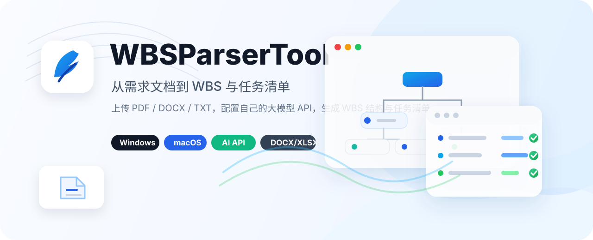

<p align="center">
  
</p>

<p align="center">
  <strong>把 PDF、DOCX、TXT 需求文档快速拆解成 WBS 工作分解结构和任务清单。</strong>
</p>

<p align="center">
  
  
  
  
  
</p>

<p align="center">
  <a href="#核心能力">核心能力</a> ·
  <a href="#下载安装">下载安装</a> ·
  <a href="#在线大模型解析">API 配置</a> ·
  <a href="#本地运行">本地运行</a> ·
  <a href="#打包">打包</a>
</p>

---

## 简介

WBSParserTool 是一个面向项目需求拆解的桌面工具。你可以上传需求文档，选择本地规则解析或在线大模型解析，生成可交付的 `工作分解结构_WBS.docx` 和 `任务清单.xlsx`。

当前项目暂作为私人内部工具维护。

## 核心能力

- **文档上传**：支持 `.pdf`、`.docx`、`.txt` 需求文档。
- **本地解析**：不依赖网络，使用内置规则快速生成基础 WBS 和任务清单。
- **在线解析**：支持自行配置 OpenAI 兼容 API，调用大模型生成更高质量的拆解结果。
- **交付导出**：自动生成 `工作分解结构_WBS.docx` 和 `任务清单.xlsx`。
- **桌面应用**：支持 Windows 安装包和 macOS `.dmg` 安装包。
- **快速保存**：Windows/macOS 均支持将交付文件一键保存到桌面。

## 下载安装

安装包会通过 GitHub Releases 发布：

- Windows 用户下载：`WBSParserTool-Setup.exe`
- macOS 用户下载：`WBSParserTool-mac.dmg`

如果 Releases 中还没有安装包，可以先下载项目代码，在本地运行或自行打包。

## 在线大模型解析

工具不内置任何 API Key。用户可以在应用内点击 `API配置`，填写自己的模型服务信息。

需要配置：

- `API Base URL`：OpenAI 兼容接口地址，例如 `https://api.example.com/v1`
- `API Key`：用户自己的接口密钥
- `模型名称`：例如 `gpt-4o-mini`、`deepseek-chat` 或其他兼容模型名称

接口要求：

- 兼容 OpenAI Chat Completions 格式
- 支持 `/chat/completions` 请求
- 返回内容为 JSON，或可被工具修复为 JSON 的结构化结果

在线解析会把需求文档正文发送给用户配置的模型服务，用于生成更细致的项目背景、WBS 层级、任务说明、负责人角色、输入输出、优先级、依赖关系和验收标准。

## 输出文件

解析完成后会生成两份交付文件：

```text
工作分解结构_WBS.docx
任务清单.xlsx
```

用户可以选择单独保存，也可以直接点击 `存到桌面`。

## 本地运行

### Windows

```powershell
python -m venv .venv
.\.venv\Scripts\Activate.ps1
pip install -r requirements.txt
python app.py
```

### macOS

```bash
python3 -m venv .venv-mac
source .venv-mac/bin/activate
pip install -r requirements.txt
python app.py
```

## 打包

### Windows

```powershell
.\build_exe.ps1
.\build_installer.ps1
```

生成结果：

```text
dist\WBSParserTool.exe
dist\WBSParserTool-Setup.exe
```

### macOS

macOS 安装包需要在 macOS 环境中构建：

```bash
chmod +x build_mac_app.sh build_mac_dmg.sh
./build_mac_dmg.sh
```

生成结果：

```text
dist/WBSParserTool.app
dist/WBSParserTool-mac.dmg
```

更详细说明见 [README_MAC.md](README_MAC.md)。

## 配置文件与隐私

API 配置保存到当前用户目录：

- Windows：`%APPDATA%\WBSParserTool\config.json`
- macOS：`~/Library/Application Support/WBSParserTool/config.json`

配置文件仅保存在本机，不会随源码仓库提交。在线解析会把文档内容发送给用户配置的第三方模型服务，敏感文档请确认服务可信后再使用。

## 卸载

Windows 项目根目录提供：

```text
Uninstall-WBSParserTool.bat
```

双击该文件会卸载已安装的 WBSParserTool，包括安装目录、桌面快捷方式、开始菜单快捷方式，以及用户目录中的配置和临时文件。

## 注意

- `dist/`、`build/`、虚拟环境和临时输出不会提交到仓库。
- macOS 版本目前未做 Apple Developer 签名和 notarization，内部使用时如遇安全提示，可右键应用选择“打开”。
